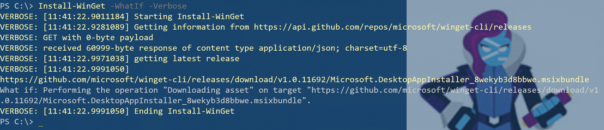
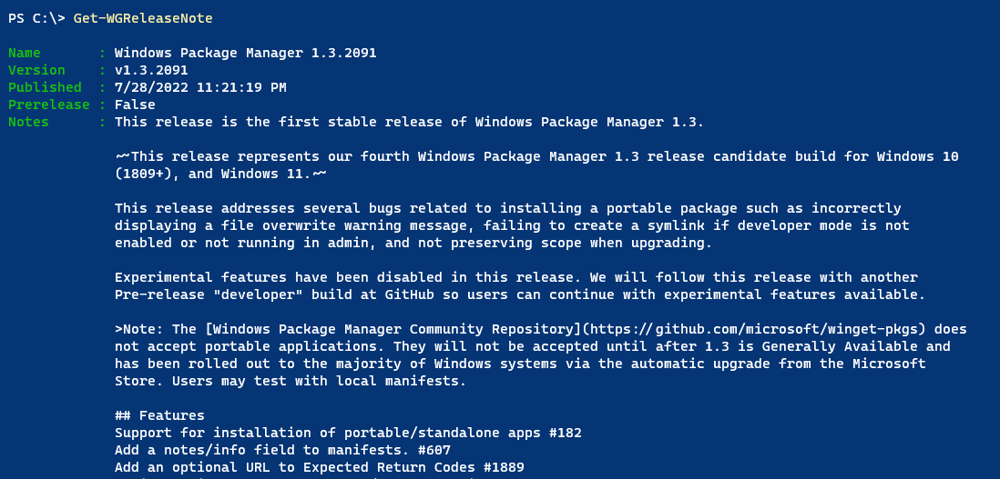
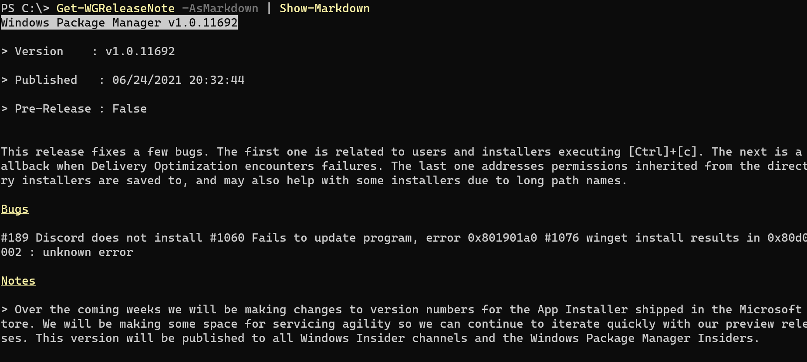
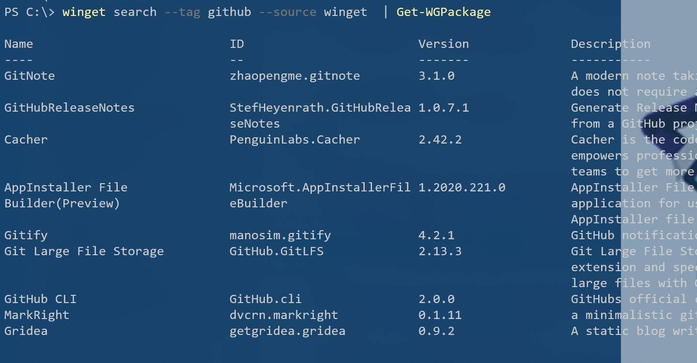
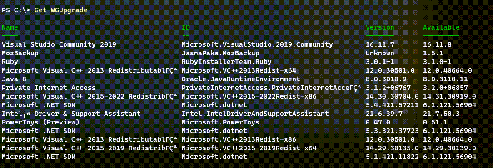
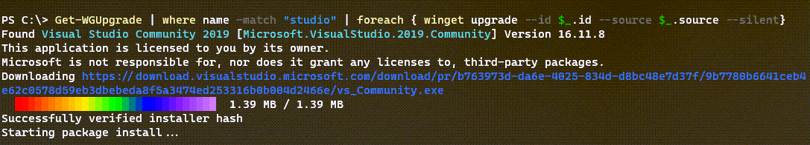

# WingetTools

[](https://www.powershellgallery.com/packages/WingetTools/) [](https://www.powershellgallery.com/packages/WingetTools/)

Install this module from the PowerShell Gallery. It should work in Windows PowerShell 5.1 and PowerShell 7.x.

```powershell
Install-Module WingetTools
```

The WingetTools module is a PowerShell wrapper around the winget command-line tool which is Microsoft's latest package manager and installer. Winget is a command-line tool, not a PowerShell command. The commands in the WingetTools module are designed to make using winget a little more PowerShell friendly.

__*NOTE:*__ The current version of this module has been tested with winget version `1.2.10271`. If you have an older version, some commands in this module may not work.

## [Install-WinGet](docs/Install-Winget.md)

Until winget is publically available in the Microsoft Store, you can download and install the latest version from Github. This command __*must be run in a Windows PowerShell session*__ in Windows 10 or Windows 11. The package requires the DesktopAppInstaller package. If it isn't found, it will be downloaded and installed.



## [Get-WGReleaseNote](docs/Get-WGReleaseNote.md)

This command will query the Github repository for the winget project and display the release note for the latest version.



You can also display it in markdown format, which is helpful if running in PowerShell 7.



You also have an option to go online to view the release note.

## [Get-WGPackage](docs/get-WGPackage.md)

This command is a PowerShell wrapper aroung winget.cmd that will get a package and create an object you can use in PowerShell.


The command has a default table view but the output object has other properties you might want to use.

```text
Name         : GitHub CLI
ID           : GitHub.cli
Version      : 2.0.0
Publisher    : GitHub, Inc.
Author       : GitHub, Inc.
Moniker      : gh
Description  : GitHubs official command-line tool.
Homepage     : https://github.com/cli/cli
License      : MIT License
License Url  : https://github.com/cli/cli/blob/HEAD/LICENSE
Type         : Msi
Locale       : en-US
Download Url : https://github.com/cli/cli/releases/download/v2.0.0/gh_2.0.0_windows_amd64.msi
SHA256       : 09761ebfcf1a294b79cf5c820d2a51edca9d5e515cbd1036c45862c462b36189
```

The command typically gets a single package, but you can pipe a winget search command to it.



## [Get-WGInstalled](docs/Get-WGInstalled.md)

This command will get a list of all packages installed with winget. These will be packages with winget as the source.

```powershell
Get-WGInstalled | Select Name,ID,Version,Homepage | Out-Gridview
```


## [Get-WGUpgrade](docs/Get-WGUpgrade.md)

This command will attempt to get all available updates and create PowerShell-friendly output.



The default output is formatted as a table. But you can use the output in PowerShell.

```dos
PS C:\> Get-WGUpgrade -Name *toys* | select *

Source    : winget
Name      : PowerToys (Preview)
ID        : Microsoft.PowerToys
Version   : 0.47.0
Available : 0.51.1
```



## [Invoke-WGUpgrade](docs/Invoke-WGUpgrade.md)

`Invoke-WGUpgrade` will run the winget upgrade process using silent installation and accepting all licenses and agreements. It supports `-Whatif`.

```dos
PS C:\> Get-WGUpgrade -Name p* | Invoke-WGUpgrade -WhatIf
What if: Performing the operation "Upgrade from 3.1.2+06767 to 3.2.0+06857" on target "PrivateInternetAccess.PrivateInternetAcce…".
What if: Performing the operation "Upgrade from 0.47.0 to 0.51.1" on target "Microsoft.PowerToys".
```

Be aware, that winget may still have a problem running the upgrade due to issues isolating upgrade packages.

## [Test-WGVersion](docs/Test-WGVersion.md)

The test command is an easy way to determine if an update for winget itself is available from Github.

```dos
PS C:\> Test-WGVersion

Installed    Online       Update    Command
---------    ------       ------    -------
1.1.13405    1.1.12653    False     C:\Users\Jeff\AppData\Local\Microsoft\Windo…
```

If an update is available and you are running the command in the PowerShell console or VSCode, the `Update` value will be displayed in green.

You can use the `-Quiet` parameter to return a Boolean result.

```dos
PS C:\> Test-WGVersion -Quiet
False
```

## Issues

If there are problems with commands in this module, try running the winget command directly. Report problems to the module's Github repository at <https://github.com/jdhitsolutions/WingetTools/issues>.

Visit the winget Github repository for more information about the project at <https://github.com/microsoft/winget-cli>.
