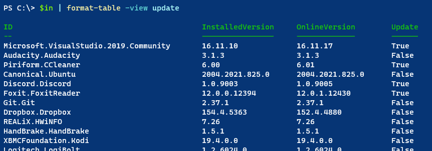

# WingetTools

[](https://www.powershellgallery.com/packages/WingetTools/) [](https://www.powershellgallery.com/packages/WingetTools/)

Install this module from the PowerShell Gallery. It should work in Windows PowerShell 5.1 and PowerShell 7.x on Windows.

```powershell
Install-Module WingetTools
```

The WingetTools module is a PowerShell wrapper around the `winget` command-line tool which is [Microsoft's latest package manager and installer](https://github.com/microsoft/winget-cli). `Winget` is a command-line tool, **not** a PowerShell command. The commands in the WingetTools module are designed to make using winget a little more PowerShell friendly.

> **NOTE:** The current version of this module has been tested with winget version `1.3.2091`. If you have an older version, some commands in this module may not work as expected.

Installing this module will also install the `ThreadJob` and [`psyml`](https://github.com/bitrut94/psyml) modules, which are dependencies.

## Background

The `winget` utility was never designed with PowerShell in mind. Without going into the years-long discussion about the lack of PowerShell support, `winget` was designed for non-PowerShell audience. The application queries online sources for package information and writes output to the console. Many of the commands in this module resort to brute force parsing of the output and then turning that output into custom objects. As such, some commands may not perform as efficiently as one would like. But they work for now.

The Winget development team is working on a PowerShell module using Crescendo, but as far as I know that is stil wrapping the native commands in PowerShell. Short of true PowerShell cmdlets, I am hoping for an option where winget output is structured data like JSON. Unfortunately for now, the commands in this module are the best workaround that I can come up with.

## [Install-WinGet](docs/Install-Winget.md)

Until winget is publically available in the Microsoft Store, you can download and install the latest version from Github. This command **must be run in a Windows PowerShell session** in Windows 10 or Windows 11. The installation is **not** supported in PowerShell 7. The `winget` package requires the DesktopAppInstaller package. If it isn't found locally, it will be downloaded and installed.


## [Get-WGReleaseNote](docs/Get-WGReleaseNote.md)

This command will query the Github repository for the winget project and display the release note for the latest version.


You can also display it in markdown format, which is helpful if running in PowerShell 7.


You also have an option to go online to view the release note.

## [Get-WGPackage](docs/get-WGPackage.md)

This command is a PowerShell wrapper aroung winget.cmd that will get a package and create an object you can use in PowerShell.


The command has a default table view but the output object has other properties you might want to use.

```text
Moniker             : gh
Description         : gh is GitHub on the command line. It brings pull
                      requests, issues, and other GitHub concepts to
                      the terminal next to where you are already working with git and your code.
Author              : GitHub, Inc.
Publisher           : GitHub, Inc.
PublisherUrl        : https://github.com
PublisherSupportUrl : https://help.github.com/en
Homepage            : https://github.com/cli/cli
Name                : GitHub CLI
ID                  : GitHub.cli
Version             : 2.15.0
Source              : winget
Computername        : WIN11DESK
```

The command typically gets a single package, but you can pipe a `winget search` command to it.


## [Get-WGInstalled](docs/Get-WGInstalled.md)

This command will get a list of all packages installed with `winget`. These will be packages with winget as the source. Here's a sample of the default output.


The custom object has a set of properties that should be found on most `winget` packages.

```powershell
PS C:\> Get-WGInstalled | where publisher -match google | select *

Name             : Google Drive
ID               : Google.Drive
InstalledVersion : 61.0.3.0
OnlineVersion    : 61.0.3.0
Publisher        : Google LLC
PublisherUrl     : https://www.google.com
Author           : Google LLC
Moniker          : google-drive
Description      : Mounts Google Drive(s) as a share drive and streams files as needed from the cloud. Alternative to
                   Google Backup and Sync.
Homepage         : https://www.google.com/drive/download/
Source           : winget
Computername     : PROSPERO
Update           : False

Name             : Google Chrome
ID               : Google.Chrome
InstalledVersion : 104.0.5112.81
OnlineVersion    : 104.0.5112.81
Publisher        : Google LLC
PublisherUrl     : https://www.google.com
Author           : Google LLC
Moniker          : chrome
Description      : A fast, secure, and free web browser built for the modern web. Chrome syncs bookmarks across all
                   your devices, fills out forms automatically, and so much more.
Homepage         : https://www.google.com/chrome
Source           : winget
Computername     : PROSPERO
Update           : False
```

This object type also has a named table view.



## [Get-WGUpgrade](docs/Get-WGUpgrade.md)

This command will attempt to get all available updates and create PowerShell-friendly output.


The default output is formatted as a table. But you can use the output in PowerShell.

```dos
PS C:\> Get-WGUpgrade -Name *toys* | select *

Source       : winget
Computername : PROSPERO
Name         : PowerToys (Preview)
ID           : Microsoft.PowerToys
Version      : 0.58.0
Available    : 0.61.1
```

## [Invoke-WGUpgrade](docs/Invoke-WGUpgrade.md)

`Invoke-WGUpgrade` will run the winget upgrade process using silent installation and accepting all licenses and agreements. It supports `-Whatif`.

```dos
PS C:\> Get-WGUpgrade -Name p* | Invoke-WGUpgrade -WhatIf
What if: Performing the operation "Upgrade from 3.2.0+06857 to 3.3.1+06924" on target "PrivateInternetAccess.PrivateInternetAccess".
What if: Performing the operation "Upgrade from 0.58.0 to 0.61.1" on target "Microsoft.PowerToys".
What if: Performing the operation "Upgrade from 3.10.3 to 3.10.6" on target "Python.Python.3".
```

You might also consider using a command like `Out-Gridview` as an object picker.

```powershell
Get-WGUpgrade | Out-GridView -OutputMode Multiple | Invoke-WGUpgrade
```

Be aware, that winget may still have a problem running the upgrade due to issues isolating upgrade packages.

## [Test-WGVersion](docs/Test-WGVersion.md)

The test command is an easy way to determine if an update for winget itself is available from Github.

```dos
PS C:\> Test-WGVersion

Installed    Online       Update    Command
---------    ------       ------    -------
1.3.2091     1.3.2091     False     C:\Users\Jeff\AppData\Local\Microsoft\WindowsApps\winget.exe
```

If an update is available and you are running the command in the PowerShell console or VSCode, the `Update` value will be displayed in green.

You can use the `-Quiet` parameter to return a Boolean result.

```dos
PS C:\> Test-WGVersion -Quiet
False
```

## Localization

Beginning with version 1.5.0, I've attempted to handle localization issues. It appears that in some locations, the winget output is localized which throws off the regular expression patterns I originally used. I am now using localized data to parse the winget output and construct the custom objects.  Currently, the only supported culture is `de-DE`. The default will be `en-US`.

If you encounter problems running module commands under a different culture, please post an issue. Include the output from these commands.

```powershell
winget show --id microsoft.powershell --source winget
Get-Culture
```

## Issues

If there are problems with commands in this module, try running the winget command directly. Report problems to the module's Github repository at <https://github.com/jdhitsolutions/WingetTools/issues>.

Visit the winget Github repository for more information about the project at <https://github.com/microsoft/winget-cli>.
